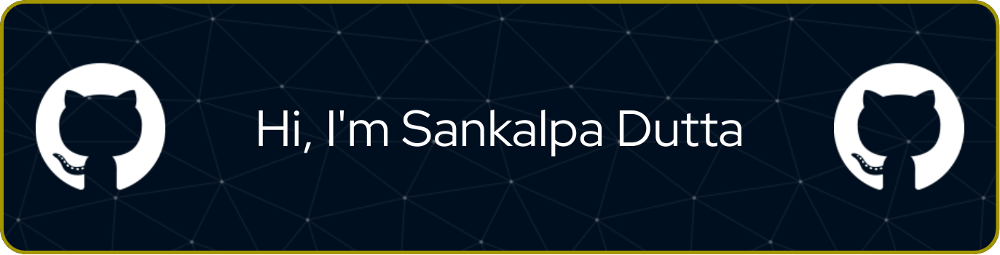

  

 

## 👋 Hey, I'm Sankalpa Dutta  

- 🌏 Developer & Tech Enthusiast from **India**  
- 🎓 Currently pursuing **B.Tech CSE (IoT, CS & Blockchain Technology)** at **University of Engineering and Management, Kolkata**  
- 🔭 Passionate about **IoT, AI/ML, Blockchain, and Full-Stack Development**  
- 🚀 Worked on projects like **traffic optimization, encrypted chat apps, competitive programming trackers, and smart IoT systems**  
- 🏆 Secured **5th place in ICDMAI Hackathon** and currently interning at **Calcutta University (R&D Department)**  
- 📚 Constantly learning and building innovative real-world solutions  

### 🌐 Find Me Around the Web  
- 💼 LinkedIn: [Sankalpa Dutta](https://www.linkedin.com/in/sankalpa-dutta-09187525b)  
- 🖥️ Portfolio: [portfolio-sd-ecru.vercel.app](https://portfolio-sd-ecru.vercel.app/)  

---

<h3 align="center">💡 "Code. Build. Innovate. Repeat."</h3>
